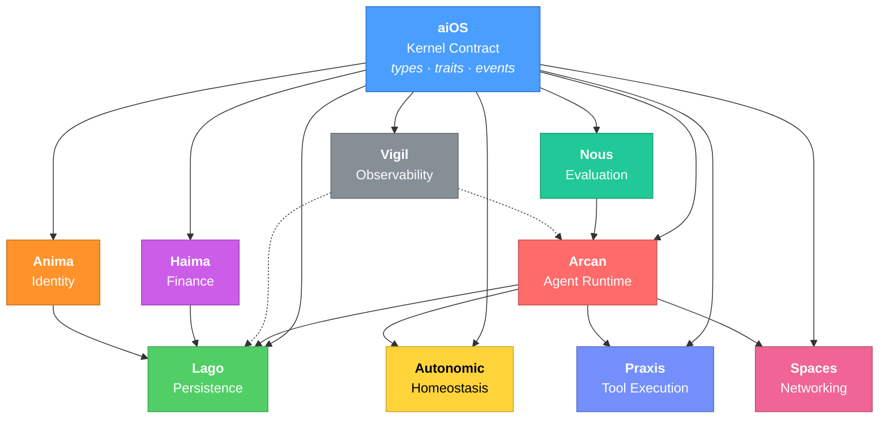

# Life

[](https://github.com/broomva/life/actions/workflows/harness.yml)
[](LICENSE)
[](https://www.rust-lang.org/)
[](#build--test)
[](#subsystems)
[](https://broomva.tech/start-here)
[](CONTRIBUTING.md)

An open-source Rust runtime for autonomous agents. 10 subsystems, 62 crates, 1,077 tests.

Life is a contract-first Agent Operating System that treats agents as living systems -- with cognition, persistence, homeostasis, identity, finance, networking, observability, and evaluation as first-class computational primitives. Each maps to a biological analog:

| Primitive | Biological Analog | Subsystem |
|-----------|------------------|-----------|
| Cognition + Execution | Central nervous system | **Arcan** |
| Tool Execution | Motor cortex / effectors | **Praxis** |
| Persistence | Long-term memory | **Lago** |
| Homeostasis | Autonomic nervous system | **Autonomic** |
| Finance | Circulatory system | **Haima** |
| Identity | DNA + immune identity | **Anima** |
| Evaluation | Metacognition | **Nous** |
| Networking | Social/swarm behavior | **Spaces** |
| Observability | Proprioception | **Vigil** |
| Contract / Genome | DNA | **aiOS** |

## Why Life?

Most agent frameworks give you a prompt loop with tool calling. Life gives you a full operating system:

- **Event-sourced persistence** -- Every agent action is an immutable event in Lago. Branch, replay, audit. Nothing is lost.
- **Homeostatic regulation** -- Autonomic monitors operational, cognitive, and economic health. Agents self-regulate instead of burning through tokens blindly.
- **Built-in finance** -- Haima implements x402 machine-to-machine payments. Agents can charge for work, manage budgets, and settle on-chain (USDC on Base).
- **Cryptographic identity** -- Anima gives each agent a soul: Ed25519 signing keys, secp256k1 wallet keys, DID-based decentralized identity, and a belief system that evolves.
- **Distributed networking** -- Spaces provides real-time agent-to-agent communication via SpacetimeDB with 5-tier RBAC and channel-based messaging.
- **Contract-first architecture** -- aiOS defines the kernel contract (types, traits, event taxonomy). Subsystems depend on the contract, never on each other's internals. Hard dependency invariants are enforced by CI.

## Compared to Other Frameworks

| | **Life** | **LangGraph** | **CrewAI** | **AutoGen** |
|---|---|---|---|---|
| **Language** | Rust | Python / JS | Python | Python |
| **Architecture** | Full OS (10 subsystems) | Graph-based workflows | Role-based agents | Multi-agent conversations |
| **Persistence** | Event-sourced (Lago) | Checkpointing | None built-in | None built-in |
| **Self-regulation** | Homeostasis controller | Manual | Manual | Manual |
| **Finance / Payments** | x402 native (Haima) | None | None | None |
| **Identity / Trust** | Ed25519 + DID (Anima) | None | None | None |
| **Agent networking** | SpacetimeDB (Spaces) | None | None | GroupChat |
| **Observability** | OpenTelemetry native (Vigil) | LangSmith | CrewAI+ | None |
| **Evaluation** | Built-in metacognition (Nous) | LangSmith Evals | None | None |
| **Tool execution** | Sandboxed (Praxis) | LangChain tools | LangChain tools | Function calling |
| **Memory safety** | Compile-time (Rust) | Runtime (Python) | Runtime (Python) | Runtime (Python) |

Life is designed for agents that run for hours or days, manage real money, and need to be auditable. If you need a quick script-to-agent wrapper, LangGraph or CrewAI will get you there faster. If you're building agents that operate autonomously in production, Life gives you the safety rails.

## Architecture



> All subsystems depend on aiOS (the kernel contract). Subsystems never import each other's internals — only bridge crates connect them. This invariant is enforced by CI.

## Subsystems

| Subsystem | Crates | Tests | Description |
|-----------|--------|-------|-------------|
| [**Arcan**](arcan/) | 13 | 429 | Agent runtime daemon -- event loop, LLM providers, capability system, TUI |
| [**Lago**](lago/) | 12 | 339 | Event-sourced persistence -- append-only journal, SHA-256 blob store, knowledge graph |
| [**Nous**](nous/) | 7 | 143 | Metacognitive evaluation -- inline heuristics, LLM-as-judge, EGRI loop |
| [**Haima**](haima/) | 6 | 164 | Agentic finance -- x402 payments, secp256k1 wallets, per-task billing |
| [**Autonomic**](autonomic/) | 5 | 134 | Homeostasis controller -- three-pillar regulation, hysteresis gates, economic modes |
| [**Anima**](anima/) | 3 | 120 | Identity -- soul profiles, belief states, Ed25519/secp256k1 dual keypair, DID |
| [**aiOS**](aiOS/) | 10 | 96 | Kernel contract -- canonical types, runtime ports, event taxonomy, policy gates |
| [**Praxis**](praxis/) | 4 | 90 | Tool execution -- sandbox, hashline editing, MCP bridge (rmcp 0.15), SKILL.md registry |
| [**Spaces**](spaces/) | 2 | 16 | Distributed networking -- SpacetimeDB 2.0, WASM module, 5-tier RBAC, real-time pub/sub |
| [**Vigil**](vigil/) | 1 | 28 | Observability -- OpenTelemetry tracing, GenAI semantic conventions, contract-derived spans |
| | **62** | **1,077** | |

## Quick Start

```bash
git clone https://github.com/broomva/life.git
cd life

# Run all 1,077 tests
cargo test --workspace

# Start the agent runtime (port 3000)
cd arcan && cargo run -p arcand

# Start the persistence daemon
cd lago && cargo run -p lagod

# Start the homeostasis controller (port 3002)
cd autonomic && cargo run -p autonomicd

# Start the finance engine (port 3003)
cd haima && cargo run -p haimad
```

### Session API

Once Arcan is running, interact via the canonical session API:

```bash
# Create an agent session
curl -X POST http://localhost:3000/sessions \
  -H "Content-Type: application/json" \
  -d '{"model": "anthropic/claude-sonnet-4-20250514"}'

# Start a run
curl -X POST http://localhost:3000/sessions/{session_id}/runs \
  -H "Content-Type: application/json" \
  -d '{"input": "What files are in the current directory?"}'

# Stream events (SSE)
curl http://localhost:3000/sessions/{session_id}/events/stream

# Branch a session (for exploration)
curl -X POST http://localhost:3000/sessions/{session_id}/branches

# Get current agent state
curl http://localhost:3000/sessions/{session_id}/state
```

## Key Design Decisions

**Why Rust?** Agents are long-running processes that manage wallets, execute arbitrary code, and make financial decisions. Memory safety, zero-cost abstractions, and fearless concurrency aren't nice-to-haves -- they're requirements. Every subsystem compiles with `clippy -D warnings`.

**Why event sourcing?** Agent state is too important to treat as mutable. Lago's append-only journal means you can replay any agent's entire history, branch from any point, and audit every decision. Content-addressed blob storage (SHA-256 + zstd) ensures integrity.

**Why a kernel contract?** aiOS defines the boundary types and runtime ports (`EventStorePort`, `ModelProviderPort`, `ToolHarnessPort`, `PolicyGatePort`, `ApprovalPort`). Subsystems implement ports, never import each other's internals. This is enforced by architecture audit scripts in CI -- not just convention.

**Why homeostasis?** Without regulation, agents oscillate between doing too little and spending too much. Autonomic tracks three pillars (operational, cognitive, economic) and advises the runtime through hysteresis-gated modes: Sovereign, Conserving, Hustle, Hibernate.

## Technology

| Layer | Stack |
|-------|-------|
| Language | Rust 2024 Edition (MSRV 1.85) |
| Async | Tokio 1.46 |
| HTTP | Axum 0.8 |
| gRPC | Tonic 0.14 + Prost 0.14 |
| Storage | redb v2 (embedded) |
| Crypto | Blake3, secp256k1, Ed25519, ChaCha20-Poly1305 |
| Distributed | SpacetimeDB 2.0 (WASM module + SDK) |
| Observability | OpenTelemetry 0.29 + tracing |
| CLI | Clap 4.5 |

## Build & Test

```bash
cargo fmt --all                          # Format
cargo clippy --workspace -- -D warnings  # Lint (zero warnings policy)
cargo test --workspace                   # 1,077 tests
cargo build --workspace                  # Full build
```

## Project Status

v0.2.0 -- Stabilization phase. The canonical baseline is active and enforced:

- All 10 subsystems build, pass clippy with `-D warnings`, and pass tests
- Architecture dependency invariants enforced by CI audit scripts
- Canonical session API is the production runtime surface
- Event sourcing through Lago is the sole persistence path

### Roadmap

- **Chronos** -- Temporal scheduler and time-awareness engine
- **Aegis** -- OS-level sandbox hardening, capability attestation, secret management
- **Mnemo** -- Vector-indexed knowledge store and RAG pipeline

## Documentation

- [Architecture](docs/ARCHITECTURE.md) -- Canonical system design
- [Contract](docs/CONTRACT.md) -- Kernel contract specification
- [Platform](docs/PLATFORM.md) -- Detailed platform specification
- [Status](docs/STATUS.md) -- Implementation health dashboard
- [Testing](docs/TESTING.md) -- Test strategy and gates
- [broomva.tech/start-here](https://broomva.tech/start-here) -- Getting started guide

## Contributing

Contributions are welcome! See [CONTRIBUTING.md](CONTRIBUTING.md) for guidelines.

- [Good first issues](https://github.com/broomva/life/labels/good%20first%20issue)
- [Open a discussion](https://github.com/broomva/life/discussions)
- [Code of Conduct](CODE_OF_CONDUCT.md)

## License

[MIT](LICENSE)
